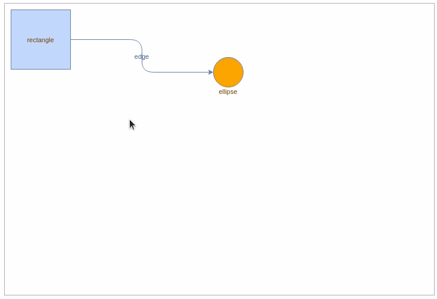

# maxGraph

[](https://www.npmjs.com/package/@maxgraph/core)
[](https://github.com/maxGraph/maxGraph/actions/workflows/build.yml)
[](https://deepwiki.com/maxGraph/maxGraph)

[//]: # (TODO apply to core/README.md and website/docs/intro.md)
<!-- copied into packages/core/README.md and packages/website/docs/intro.md -->
`maxGraph` is a TypeScript library for building interactive diagram applications. At its core, it manages:
- **Vertices** — Nodes displayed as shapes (rectangles, ellipses, custom designs)
- **Edges** — Connections between vertices (lines, arrows, custom paths)

Beyond basic diagram editing (resize, move, rotate), `maxGraph` provides automatic layout algorithms, graph theory operations, and deep API-level control. 
It's designed for developers building custom diagramming tools—flowchart editors, data lineage visualizers, network maps, process designers — where off-the-shelf solutions lack the flexibility or programmability you need.

`maxGraph` continues the legacy of [mxGraph](https://github.com/jgraph/mxgraph) (archived in 2020) as its actively maintained successor.
It preserves mxGraph's comprehensive features and XML compatibility while modernizing with native TypeScript, modular architecture, and smaller bundle sizes.
Active development ensures continuous bug fixes and new capabilities.
<!-- END OF 'copied into packages/core/README.md and packages/website/docs/intro.md' -->


## Features

- 🎨 **Rich visual library** — Built-in shapes, custom stencils, and various edge routing algorithms (orthogonal, Manhattan, elbow, etc.)
- 🔀 **Automatic layouts** — Hierarchical, tree, circle, organic, and swimlane layouts for organized diagrams
- 🖱️ **Interactive editing** — Move, resize, rotate, connect, and edit cells with mouse and keyboard
- 📂 **Hierarchical grouping** — Organize elements with groups, collapse/expand, and drill-down navigation
- ↩️ **Undo/redo** — Full history tracking for all operations
- 💾 **XML import/export** — Compatible with mxGraph format for data persistence
- 🎯 **Event system** — React to any graph change (clicks, moves, adds, removes, style changes)
- 🛠️ **Native TypeScript** — Complete type definitions, zero dependencies, tree-shakable architecture
- 🔌 **Framework-agnostic** — Works with React, Vue, Angular, or vanilla JavaScript
- 🎨 **Highly customizable** — 100+ style properties per cell, custom shapes, and plugin architecture

[📚 View full feature list](https://maxgraph.github.io/maxGraph/docs/intro#features)


## Browser support

Chrome, Edge, Firefox, Safari, Chromium based browsers (Brave, Opera, ....) for mobile and desktop.

## Project status

`maxGraph` is currently under active development, with a few adjustments still required to match the behavior of `mxGraph`.
In the meantime, new features are also being added to enrich the library.

Please try it in your application and [submit an issue](https://github.com/maxGraph/maxGraph/issues) if you think that something is not working.

You can also test `maxGraph` by running the [Storybook examples](#development).

## Install
<!-- copied into packages/website/docs/getting-started.mdx -->

Install the latest version of `maxGraph` from the [npm registry](https://www.npmjs.com/package/@maxgraph/core).

npm
```
npm install @maxgraph/core
```

pnpm
```
pnpm add @maxgraph/core
```

yarn
```
yarn add @maxgraph/core
```

`maxGraph` is written in TypeScript and provides type definitions for seamless integration into TypeScript applications.

Compatibility of the npm package:
- The JavaScript code conforms to the `ES2020` standard and is available in both CommonJS and ES Module formats
- TypeScript integration requires **TypeScript 3.8** or higher

<!-- END OF 'copied into packages/website/docs/getting-started.mdx' -->

## Getting Started
<!-- copied into packages/website/docs/getting-started.mdx -->

Here is an example that shows how to display a rectangle connected to an orange circle.

This example assumes that
- you are building an application that includes the maxGraph dependency, and it has been installed as explained above.
- your application uses a build tool or a bundler for its packaging. Direct usage of `maxGraph` in a web page is not supported (for more details, see [#462](https://github.com/maxGraph/maxGraph/discussions/462)).
- your application includes a page that defines an element with the id `graph-container`.
- you're using `TypeScript`. For `JavaScript`, simply remove references to the 'type' syntax.

```typescript
import {type CellStyle, Graph, InternalEvent} from '@maxgraph/core';

const container = <HTMLElement>document.getElementById('graph-container');
// Disables the built-in context menu
InternalEvent.disableContextMenu(container);

const graph = new Graph(container);
graph.setPanning(true); // Use mouse right button for panning

// Adds cells to the model in a single step
graph.batchUpdate(() => {
  const vertex01 = graph.insertVertex({
    position: [10, 10],
    size: [100, 100],
    value: 'rectangle',
  });
  const vertex02 = graph.insertVertex({
    position: [350, 90],
    size: [50, 50],
    style: {
      fillColor: 'orange',
      shape: 'ellipse',
      verticalAlign: 'top',
      verticalLabelPosition: 'bottom',
    },
    value: 'ellipse',
  });
  graph.insertEdge({
    source: vertex01,
    target: vertex02,
    value: 'edge',
    style: {
      edgeStyle: 'orthogonalEdgeStyle',
      rounded: true,
    },
  });
});
```

You will see something like in the following _maxGraph panning_ demo:



<!-- END OF 'copied into packages/website/docs/getting-started.mdx' -->

## Documentation

The maxGraph documentation is available on the [maxGraph website](https://maxgraph.github.io/maxGraph).

> [!WARNING]  
> This is a **work in progress**, the content will be progressively improved.


## Examples
<!-- copied into packages/website/docs/demo-and-examples.md -->

For more comprehensive examples than the “Getting started” example, here is a list of demos and examples to help you understand how to use `maxGraph` and integrate it into your projects.

Note that they are based on `maxGraph` features, which require the use of [CSS and images](packages/website/docs/usage/css-and-images.md) provided in the npm package.

- the [storybook stories](packages/html/stories) which demonstrates various features of maxGraph.
  - The stories are currently written in `JavaScript` and will be progressively migrated to `TypeScript`.
  - A live instance is available on the [maxGraph website](https://maxgraph.github.io/maxGraph/demo).
- the [ts-example](packages/ts-example) project/application that demonstrates how to define and use custom `Shapes` with `maxGraph`. It is a vanilla TypeScript application built by [Vite](https://vitejs.dev/).
- the [ts-example-jest-commonjs](packages/ts-example-jest-commonjs) project that demonstrates how to run jest tests involving `maxGraph` with ts-jest, using CommonJS.
- the [ts-example-selected-features](packages/ts-example-selected-features) project/application that demonstrates the same use case as in `ts-example` but which only loads the features and configuration required by the application for an efficient tree-shaking. It is a vanilla TypeScript application built by [Vite](https://vitejs.dev/).
- the [ts-example-without-defaults](packages/ts-example-without-defaults) project/application that demonstrates how to not use defaults plugins and style defaults (shapes, perimeters, ...). It is a vanilla TypeScript application built by [Vite](https://vitejs.dev/).
- the [js-example](packages/js-example) project/application that demonstrates how to import and export the `maxGraph` model with XML data. It is a vanilla JavaScript application built by [Webpack](https://webpack.js.org/).
- the [js-example-nodejs](packages/js-example-nodejs) project that demonstrates how to use `maxGraph` in a headless environment with Node.js.
- the [js-example-selected-features](packages/js-example-selected-features) project/application that demonstrates the same use case as in `ts-example` but which only loads the features and configuration required by the application for an efficient tree-shaking. It is a vanilla JavaScript application built by [Webpack](https://webpack.js.org/).
- the [js-example-without-defaults](packages/js-example-without-defaults) project/application that demonstrates how to not use defaults plugins and style defaults (shapes, perimeters, ...). It is a vanilla JavaScript application built by [Webpack](https://webpack.js.org/).
- the [maxgraph-integration-examples](https://github.com/maxGraph/maxgraph-integration-examples) repository which shows how to integrate `maxGraph` with different frameworks and build tools.

<!-- END OF 'copied into packages/website/docs/demo-and-examples.md' -->


## <a id="migrate-from-mxgraph"></a> Migrating from mxGraph

`maxGraph` APIs are not fully compatible with `mxGraph` APIs. The concepts are the same, so experienced `mxGraph` users should be able to switch from `mxGraph` to `maxGraph` without issues.

For a complete guide, see the [dedicated migration page](packages/website/docs/usage/migrate-from-mxgraph.md).


## Support

<!-- copied into packages/website/docs/getting-started.mdx -->
For usage question, please open a new [discussion](https://github.com/maxGraph/maxGraph/discussions/categories/q-a) on GitHub. You can also use
[GitHub discussions](https://github.com/maxGraph/maxGraph/discussions) for other topics like `maxGraph` development or to get the latest news.

For bug reports, feature requests, or other issues, please open a new [issue](https://github.com/maxGraph/maxGraph/issues) on GitHub.
<!-- END OF 'copied into packages/website/docs/getting-started.mdx' -->


## History

On 2020-11-09, the development on `mxGraph` stopped and `mxGraph` became effectively end of life.

On 2020-11-12, a fork of the `mxGraph` was created with a call to Contributors.

> 12 Nov 2020.
> 
> If you are interested in becoming a maintainer of mxGraph please comment on issue [#1](https://github.com/maxGraph/maxGraph/issues/1)
> 
> Initial objectives:
> 
> - The first priority is to maintain a working version of mxGraph and its **npm package**
> - The ambitious stretch goal is to refactor the codebase to create a modern modular, tree shakable, version of mxGraph to reduce the whole package size.
> 
> -- Colin Claverie

The project was then [renamed on 2021-06-02](https://github.com/maxGraph/maxGraph/discussions/47) into `maxGraph` due to [licensing issue](https://github.com/maxGraph/maxGraph/discussions/23).

Starting from the `mxGraph` 4.2.2 release, we
- moved code to ES9
- removed Internet Explorer specific code
- migrated to TypeScript, based on the work initiated in [typed-mxgraph](https://github.com/typed-mxgraph/typed-mxgraph)
- migrated the examples to [Storybook](https://storybook.js.org/)
- added new features and improvements
- progressively improved the documentation and the examples
- introduced tree-shaking with the `BaseGraph` and plugins architecture
- to be continued...

**TODO reword this paragraph + duplicate in website**

## Development

### Contributing

We welcome contributions! Please see the [contributing guide](./CONTRIBUTING.md) for:
- Setup instructions and prerequisites
- Development workflow and commands
- Code quality standards
- Pull request process

### Quick Command Reference

```bash
# Setup
nvm use                           # Use correct Node.js version
npm install                       # Install dependencies

# Development (run in parallel)
npm run dev -w packages/core      # Watch and rebuild core
npm run dev -w packages/html      # Run Storybook examples

# Building
npm run all                       # Build everything + run tests

# Testing
npm test -w packages/core         # Run tests
npm run lint                      # Check code quality
```

For comprehensive commands and architecture details, see [CLAUDE.md](CLAUDE.md).

### Building the npm Package Locally

Released versions are available at [npmjs](https://www.npmjs.com/package/@maxgraph/core).

To build locally:

```bash
# From project root
npm install

# From packages/core folder
npm pack
```

The `packages/core` folder or the generated `maxgraph-core-*.tgz` file can be used in your application via [npm link](https://docs.npmjs.com/cli/v8/commands/npm-link) or `npm install`.

Integration examples can be found in the [maxgraph-integration-examples](https://github.com/maxGraph/maxgraph-integration-examples) repository.

### Release Process

See the [release documentation](packages/website/docs/development/release.md) for details on the release process.
