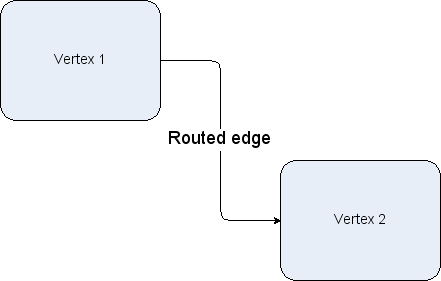
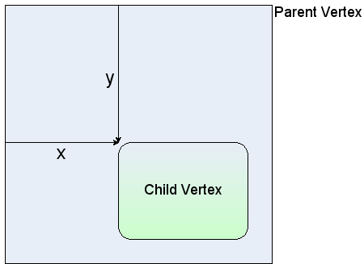
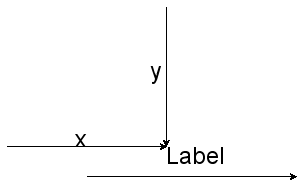
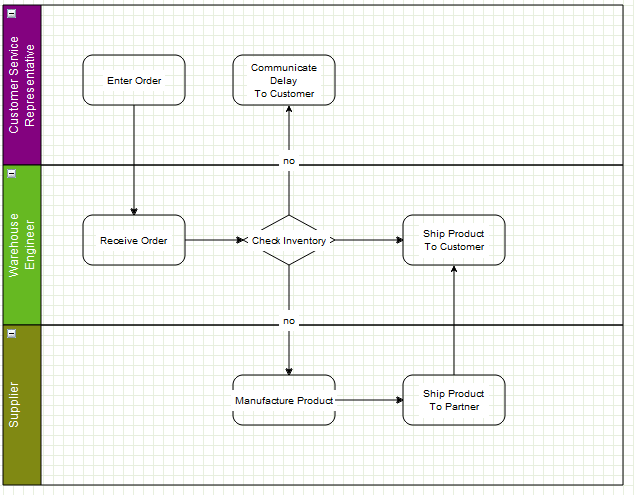
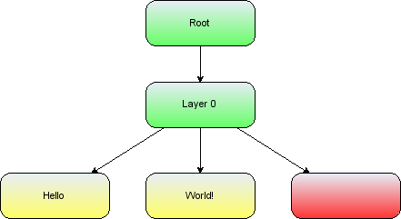
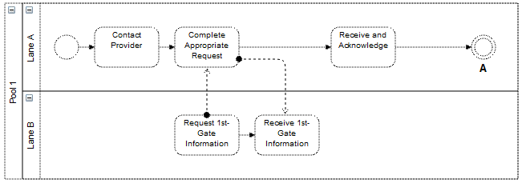
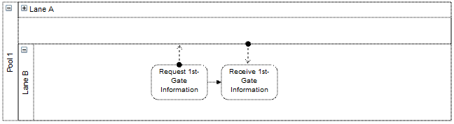
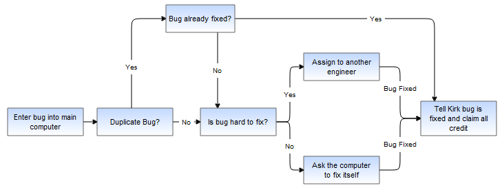
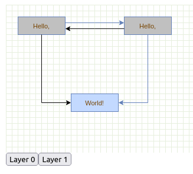

# Model and Cells

:::warning

The content of this page is a work in progress. The original `mxGraph` manual is progressively migrated here.

Original documentation: [Model and Cells (mxGraph)](https://jgraph.github.io/mxgraph/docs/manual.html#3)

:::


:::note

This manual is licensed under [Creative Commons Attribution 4.0 International (CC BY 4.0)](https://creativecommons.org/licenses/by/4.0/). \
It is adapted from the original [mxGraph manual](https://github.com/jgraph/mxgraph/blob/v4.2.2/docs/manual.html).

> Copyright 2021-present The maxGraph project Contributors \
Copyright (c) JGraph Ltd 2006-2020

:::


## Core `maxGraph` architecture

### The `maxGraph` Model

The `maxGraph` model is the core model that describes the structure of the graph, the class is called GraphModel and is found within the model package.
Additions, changes and removals to and from the graph structure take place through the graph model API.
The model also provides methods to determine the structure of the graph, as well as offering methods to set visual states such as visibility, grouping and style.

However, although the transactions to the model are stored on the model, `maxGraph` is designed in such a way that the main public API is through the `maxGraph` class. 
The concept of "add this cell to the graph" is a more natural description of the action than "add this cell to the model of the graph".
Where it is intuitive, functions available on the model and cells are duplicated on the graph and those methods on the graph class are considered the main public API.

So, though many of the main API calls are through the `maxGraph` class, keep in mind that `GraphDataModel` is the underlying object that stores the data structure of your graph.

`maxGraph` uses a transactional system for making changes to the model. In the [HelloWorld example](../tutorials/the-hello-world-example.md) we saw this code that performs the insertion of the 2 vertices and 1 edge:

```javascript
// Adds cells to the model in a single step
graph.getModel().beginUpdate();
try {
   const v1 = graph.insertVertex(parent, null, 'Hello,', 20, 20, 80, 30);
   const v2 = graph.insertVertex(parent, null, 'World!', 200, 150, 80, 30);
   graph.insertEdge(parent, null, '', v1, v2);
}
finally {
   // Updates the display
   graph.getModel().endUpdate();
}
```

For each change to the model you make a call to `beginUpdate()`, make the appropriate calls to change the model, then call `endUpdate()` to finalize the changes and have the change event notifications sent out.

**Key API Methods:**
  - **GraphModel.beginUpdate()** - starts a new transaction or a sub-transaction.
  - **GraphModel.endUpdate()** - completes a transaction or a sub-transaction.
  - **Graph.addVertex()** - Adds a new vertex to the specified parent cell.
  - **Graph.addEdge()** - Adds a new edge to the specified parent cell.


:::note

Technically you do not have to surround your changes with the _begin_ and _end_ update calls.
Changes made outside of this update scope take immediate effect and send out the notifications immediately.

In fact, changes within the update scope enact on the model straight away, the update scope is there to control the timing and concatenation of event notifications.
Unless the update wrapping causes code aesthetic issues, it is worth using it by habit to avoid possible problems with event and undo granularity.
:::


Note the way in which the model changes are wrapped in a try block and the `endUpdate()` in a "finally" block.
This ensures the update is completed, even if there is an error in the model changes.
You should use this pattern wherever you perform model changes for ease of debugging.

Ignore the reference to the `parent` cell for now, that will be explained later in this chapter.


### The Transaction Model

The sub-transaction in the blue block above refers to the fact that transactions can be nested.
That is, there is a counter in the model that increments for every `beginUpdate` call and decrements for every `endUpdate` call.
After increasing to at least 1, when this count reaches 0 again, the model transaction is considered complete and the event notifications of the model change are fired.

This means that every sub-contained section of code can (and should) be surrounded by the begin/end combination.
This provides the ability in `maxGraph` to create separate transactions that be used as "library transactions",
the ability to create compound changes and for one set of events to be fired for all the changes and only one undo created.
Automatic layouting is a good example of where the functionality is required.

In automatic layouting, the user makes changes to the graph, usually through the user interface, and the application automatically positions the result according to some rules.
The automatic positioning, the layouting, is a self-contained algorithm between begin/end update calls that has no knowledge of the specifics of the change.
Because all changes within the begin/end update are made directly to the graph model, the layout can act upon the state of the model as the change is in progress.

It is important to distinguish between functionality that acts on the graph model as part of a compound change and functionality that reacts to atomic graph change events.
In the first case, such as for automatic layouting, the functionality takes the model as-is and acts upon it.
This method should only be used for parts of compound model changes.
All other parts of the application should only react to model change events.

Model change events are fired when the last endUpdate call reduces the counter back down to 0 and indicate that at least one atomic graph change has occurred.
The change event contains complete information as to what has altered (see later section on **Events** for more details).


### The Model Change Methods

Below is a list of the methods that alter the graph model and should be placed, directly or indirectly, with the scope of an update:

- add(parent, child, index)
- remove(cell)
- setCollapsed(cell, collapsed)
- setGeometry(cell, geometry)
- setRoot(root)
- setStyle(cell, style)
- setTerminal(cell, terminal, isSource)
- setTerminals(edge,source,target)
- setValue(cell, value)
- setVisible(cell, visible)

Initially, we will just concern ourselves with the add and remove, as well as the geometry and style editing methods.
Note that these are not core API methods, as usual these methods are on the `maxGraph` class, where appropriate, and they perform the update encapsulation for you.

:::info

**Design Background** \
Some people are confused by the presence of visual information being stored by the model.
These attributes comprise cell positioning, visibility and collapsed state.
The model stores the default state of these attributes, providing a common place to set them on a per-cell basis, whereas, views can override the values on a per-view basis.

The model is simply the first common place in the architecture where these attributes can be set on a global basis.
Remember, this is a graph <em>visualization</em> library, the visualization part is the core functionality
:::

[//]: # (--------------------------------------------------------------------------------------------------------------)
[//]: # (TODO split page here - above is "Model and Transactions", below Cells)
[//]: # (or keep "inserting cells" in this page as well)
[//]: # (--------------------------------------------------------------------------------------------------------------)


### Inserting Cells

The three graph cells created in the [HelloWorld example](../tutorials/the-hello-world-example.md) are two vertices and one edge connecting the vertices.
If you are not familiar with basic graph theory and its terminology, please see the [Graph Theory wikipedia entry](http://en.wikipedia.org/wiki/Graph_theory).

You can add vertices and edges using the `add()` method on the model.
However, for the purposes of general usage of this library, learn that `Graph.insertVertex()` and `Graph.insertEdge()` are the core public API for adding cells.
The function of the model requires that the cell to be added is already created, whereas the `Graph.insertVertex()` creates the cell for you.

**Core API functions:**

- **Graph.insertVertex(parent, id, value, x, y, width, height, style)** - creates and inserts a new vertex into the model, within a begin/end update call.
- **Graph.insertEdge(parent, id, value, source, target, style)** - creates and inserts a new edge into the model, within a begin/end update call.


`Graph.insertVertex()` will create an `Cell` object and return it from the method used. The parameters of the function are:
- `parent`: the cell which is the immediate parent of the new cell in the group structure.
We will address the group structure shortly, but for now use `graph.getDefaultParent()` as your default parent, as used in the HelloWorld example.
- `id`: this is a global unique identifier that describes the cell, it is always a string. This is primarily for referencing the cells in the persistent output externally.
If you do not wish to maintain ids yourself, pass null into this parameter and ensure that GraphDataModel.isCreateIds() returns true. This way the model will manage the ids and ensure they are unique.
- `value`: this is the user object of the cell. User object are simply that, just objects, but form the objects that allow you to associate the business logic of an application with the visual representation of `maxGraph`.
They will be described in more detail later in this manual, however, to start with if you use a string as the user object, this will be displayed as the label on the vertex or edge.
- `x, y, width, height`: as the names suggest, these are the x and y position of the top left corner of the vertex and its width and height.
- `style`: the style description to be applied to this vertex. Styles will be described in more detail shortly, but at a simple level this parameter is a string that follows a particular format.
In the string appears zero or more style names and some number of key/value pairs that override the global style or set a  new style.
Until we create custom styles, we will just use those currently available.

With the edge addition method, the identically named parameters perform the same function as in the vertex addition method.
The source and target parameters define the vertices to which the edge is connected.
Note that the source and target vertices should already have been inserted into the model.


### Cell

`Cell` is the cell object for both vertices and edges. `Cell` duplicates many of the functions available in the model.
The key difference in usage is that using the model methods creates the appropriate event notifications and undo, using the cell makes the change but there is no record of the change.
This can be useful for temporary visual effects such as animations or changes on a mouse over, for example.
As a general rule though, use the model editing API unless you encounter a specific problem with this mechanism.

When creating a new cell, three things are required in the constructor, a value (user object), a geometry and a style.
We will now explore these 3 concepts before returning to the cell.


#### Styles

:::warning
The following section includes screenshots that relates to the `mxGraph` style mechanism.
The style mechanism has changed in `maxGraph` (style is now an object, and no longer a string). The screenshots will be later updated.
:::

The concept of styles and stylesheets in conceptually similar to CSS stylesheets, though note that CSS are actually used in `maxGraph`, but only to affect global styles in the DOM of the HTML page.
The style properties in maxGraph are defined in [CellStateStyle](https://maxgraph.github.io/maxGraph/api-docs/types/CellStateStyle.html) and [CellStyle](https://maxgraph.github.io/maxGraph/api-docs/types/CellStyle.html) objects.

Some of the styles apply to vertices, some to edges and some to both. As you can see, these define visual attributes on the element they act upon.

The Stylesheet holds a Map that associates style names with style objects:


_Style properties within the styles collection_


In the above image the blue box represents the styles object in `StyleSheet`. For example, the string 'defaultVertex' is the key to a style object.

Note that `maxGraph` creates two default styles, one for vertices and one for edges.
If you look back to the [hello world example](../tutorials/the-hello-world-example.md), no style was passed into the optional style parameter of `insertVertex` or `insertEdge`.
In this case the default style would be used for those cells.


<a id="setting_cell_style"></a>
##### Setting the Style of a Cell

If you wanted to specify a style other than the default for a cell, you must pass that new style either to the cell when it is created
(`insertVertex` and `insertEdge` both have an optional parameter for this) or pass that style to the cell using `GraphDataModel.setStyle()`.

The style that you pass has the form style name, and it must be stored in the `baseStyleNames` property of the `CellStyle` object representing the entire style.
Note that the base style names and the other style properties may be in any order.

Below are examples to demonstrate this concept, adapting the `insertVertex` call we saw in the [hello world example](../tutorials/the-hello-world-example.md):
- A new style called _ROUNDED_ has been created, to apply this to a vertex:
```javascript
const v1 = graph.insertVertex(parent, null, 'Hello', 20, 20, 80, 30,
    {
      baseStyleNames: ['ROUNDED'],
    });
```
- To create a new vertex with the _ROUNDED_ style, overriding the stroke and fill colors:
```javascript
const v1 = graph.insertVertex(parent, null, 'Hello', 20, 20, 80, 30,
    {
      baseStyleNames: ['ROUNDED'],
      strokeColor: 'red',
      fillColor: 'green',
    });
```
- To create a new vertex with no global style, but with local stroke and fill colors:
```javascript
const v1 = graph.insertVertex(parent, null, 'Hello', 20, 20, 80, 30,
    {
      ignoreDefaultStyle: true,
      strokeColor: 'red',
      fillColor: 'green',
    });
```
- To create a vertex that uses the _defaultVertex_ style, but a local value of the fill color:
```javascript
const v1 = graph.insertVertex(parent, null, 'Hello', 20, 20, 80, 30,
  {
    baseStyleNames: ['defaultVertex'], // This can be ommited, as it is the default style apply for vertices
    fillColor: 'blue',
  });
```

Again, the `maxGraph` class provides utility functions that form the core API for accessing and changing the styles of cells:

**Core API functions:**
- **Graph.setCellStyle(style, cells)**: Sets the style for the array of cells, encapsulated in a begin/end update.
- **Graph.getCellStyle(cell)**: Returns the style for the specified cell, merging the styles from any local style and the default style for that cell type.


##### Creating a New Global Style

To create the _ROUNDED_ global style described above, you can follow this template to create a style and register it with `StyleSheet`:

```javascript
const style = {
  shape: 'rectangle',
  opacity: 50,
  fontColor: '#774400',
};
graph.getStylesheet().putCellStyle('ROUNDED', style);
```


#### Geometry

In the [hello world example](../tutorials/the-hello-world-example.md), we saw the position and size of the vertices passed into the `insertVertex` function.
The coordinate system in JavaScript is `x` is positive to the right and `y` is positive downwards, and in terms of the graph, the positioning is absolute to the container within which the `maxGraph` is placed.

The reason for a separate `Geometry` class, as opposed to simply having the `Rectangle` class store this information, is that the edges also have geometry information.

The `width` and `height` values are ignored for edges and the `x` and `y` values relate to the positioning of the edge label.
In addition, edges have the concept of **control points**. These are intermediate points along the edge that the edge is drawn as passing through.
The use of control points is sometimes referred to as **edge routing**.



_An edge routed by 2 control points_

There are two more important additional concepts in geometry, relative positioning and offsets, which are described in the following sections.


##### Relative Positioning

By default, the `x` and `y` position of a vertex is the offset of the top left point of the bounding rectangle of the parent to the top left point of the bounding rectangle of the cell itself.
The concept of parents and groups is discussed later in this chapter, but without going into too much detail, if a cell does not have cell parent, the graph container is its parent for positioning purposes.




_Non-relative vertex positioning_


For an edge, in non-relative mode, which is the default mode, the edge label position is the absolute offset from the graph origin.



_Non-relative edge label positioning_


For vertices in relative mode, `(x, y)` is the proportion along the parent cell's (width, height) where the cell's origin lies.
(0, 0) is the same origin as the parent, (1, 1) places the origin in the bottom right corner of the parent.
The same relative positioning extends below 0 and above 1 for both dimensions. This positioning is useful for keeping child cells fixed relative to the overall parent cell size.


_Relative vertex positions_

Lastly, edge labels in relative mode are placed based on the positioning from the center of the edge.
The x-coordinate is the relative distance from the source end of the edge, at -1, to the target end of the edge, at 1.
The y co-ordinate is the pixel offset orthogonal from the edge.

The diagram below shows the values of `x,y` for various edge labels in relative mode.
Note that for a straight edge, the calculations are simple.
For edges with multiple control points, the edge has to be traced along its segments (a segment being the line between end points and/or control points) to find the correct distance along the edge.
The `y` value is the orthogonal offset from that segment.

Switching relative positioning on for edge labels is a common preference for applications. Navigate to the `Graph.insertEdge()` function in `maxGraph`, you will see this calls `createEdge()`.
In createEdge() the geometry is set relative for every edge created using this prototype.
This is partly the reason for the amount of helper functions in `Graph`, they enable easy changing of the default behaviour. \
You should try to use the `Graph` class API as much as possible to provide this benefit in your applications.


##### Offsets

The offset field in Geometry is an absolute `x,y` offset applied to the cell **label**.
In the case of edge labels, the offset is always applied after the edge label has been calculated according to the relative flag in the above section.

**Core API functions:**

- **Graph.resizeCell(cell, bounds)** - Resizes the specified cell to the specified bounds, within a begin/end update call.
- **Graph.resizeCells(cells, bounds)** - Resizes each of the cells in the cells array to the corresponding entry
in the bounds array, within a begin/end update call.


#### User Objects

The _User Object_ is what gives `maxGraph` diagrams a context, it stores the business logic associated with a visual cell.
In the [hello world example](../tutorials/the-hello-world-example.md), the user object has just been a string, in this case it simply represents the label that will be displayed for that cell. \
In more complex applications, these user objects will be objects instead.
Some attribute of that object will generally be the label that the visual cell will display, the rest of the object describes logic relating to the application domain.

Using the example of a simple workflow or process application, say we have the graph below:




_A simple workflow_


Typically, this workflow will exist on some application server and/or database.
The browser user connects to that server, or some front-end server linked to the application server and the user's web application requests the "order" workflow.
The server obtains the data of that workflow and transmits it to the client.

`maxGraph` supports the process of populating the model on the server-side and transmitting to the client, and back again.
See the later chapter on [I/O and Server Communication](../tutorials/editor-input-output.md).

The data transmitted will be both the visual model (the diagram) and the business logic (mostly contained in the user objects).
The client will initially show the diagram above. If the user has permission to edit this workflow they will normally be able to do two things:
1. edit the diagram, add and remove vertices, as well as changing the connections
2. edit the user objects of the cells (vertices and/or edges).


:::warning
The following demo is currently not available in `maxGraph`. See the original [workfloweditor](http://www.jgraph.com/demo/mxgraph/editors/workfloweditor.html) `mxGraph` demo for now.
:::
In the online demo, if you right-click and select properties of the "Check Inventory" diamond you will see this dialog:


_The properties of a vertex_

These properties show the geometry, label, ID etc., but a dialog could just as easily show the user object of the cell.
There might be a reference to some process on the workflow engine as to how the inventory is actually checked.
This might be an application specific mechanism for both the server and client to assign some identification to remote method calls. \
Another value might be the type of object that process returned, maybe a boolean or an integer to indicate stock level in this case.
Given that return type, it is possible to enforce constraints with the diagram and provide visual alerts of if, say, the outgoing edges decision check does not correspond to the return type of the vertex.

Next, as an example, the user objects of the outgoing edges might contain a label and a boolean state.
Again, the `maxGraph`-based editor might provide the means to alter the boolean value.
On the server, when executing the process, it might follow the edges that correspond to the boolean value returned by the decision node.

Keep in mind that the above example is very domain specific, it is there to explain how the user object maps to the business logic of the application.
It visualizes how `maxGraph` creates what we term a **contextual graph**. The context is formed by the connections between vertices and the business logic stored within the user objects. \
A typical application receives the visual and business logic from a sever, may allow editing of both, then transmits both back to the server for persistence and/or execution.


#### Cell Types

As described previously, `Graph` is the primary API for using this library and the same concept applies to cells.
One basic state of the cell not exposed on the graph is whether a cell is a vertex or an edge, this call be performed on the cell or on the model.

There are two boolean flags on `Cell`, vertex and edge, and the helper methods set one of these to true when the cell is created.
`isVertex()` and `isEdge()` on GraphDataModel are what the model uses to determine a cell's type, there are no separate objects for either type.
Technically, it is possible to switch the type of cell at runtime, but take care to invalidate the cell state (see later section) after changing the type. \
Also, be aware that the geometry object variable means different things to vertices and edges. Generally, it is not recommended to change a cell type at runtime.


### Group Structure

Grouping, within `maxGraph`, is the concept of logically associating cells with one another.
This is commonly referred to as the concept of sub-graphs in many graph toolkits.
Grouping involves one or more vertices or edges becoming children of a parent vertex or edge (usually a vertex) in the graph model data structure.
Grouping allows `maxGraph` to provide a number of useful features:
- Sub-graphs, the concept of a logically separate graph that is displayed in the higher level graph as a cell per sub-graph.
- Expanding and collapsing, the ability to replace a collection of grouped cells visually with just their parent cell. Expanding is the reverse of this.
This behaviour can be seen by clicking the small "-" in the top left corner of the group cells of the swimlanes example in the [online workfloweditor](http://www.jgraph.com/demo/mxgraph/editors/workfloweditor.html) example.
This is described in the _Complexity Management_ section below.
- Layering, the concept of assigning cells to a particular z-order layer within the graph display.
- Drill down, step up, these concepts allow sub-graphs to be visualized and edited as if they are a complete graph. In the _User Objects_ section we saw the "check inventor" vertex as a single cell.
Take, for example, the case where a developer is describing each of the vertices in the process as the software processes that perform the task.
The application might have an option to drill down into the "check inventory" vertex. This would result in a new graph appearing that describes in detail how exactly the system checks the inventory.
The graph might have the title of the parent "check inventory" vertex to indicate it is a child, as well as the option to step-up back to the next level up.


In grouping, cells are assigned a parent cell. In the simplest case, all cells have the default parent as their parent. \
The default parent is an invisible cell with the same bounds as the graph.
This is the cell returned by graph.getDefaultParent() in the [hello world example](../tutorials/the-hello-world-example.md). \
The `x,y` position of a vertex is its position relative to its parent, so in the case of default grouping (all cells sharing the default parent) the cell positioning is also the absolute co-ordinates on the graph
component. \
In the case all cells being added to the default root, the group structure logically looks like, in the case of the [hello world example](../tutorials/the-hello-world-example.md), the diagram below.

Note the addition of the `Layer 0` cell, this is the default indirection in the group structure that allows layer changes with the requirement of additional cells. \
We include it below for correctness, but in later group diagrams it will be omitted.

<a id="group_structure_helloword_example"></a>



_The group structure of the "hello world" example_

Also, note that the position of the edge label (x,y in geometry) is relative to the parent cell.

If we go back to the simple workflow example in the _User Objects_ section, we can see what grouping might look like visually. \
In the example the group cells represent people and the child vertices represent tasks assigned to those people. In this example the logical group structure looks like this:


_The logical group structure of the workflow example_

The workflow action vertices are the yellow children and the swimlane group vertices are marked blue.

Inserting cells into the group structure is achieved using the parent parameter of the `insertVertex` and `insertEdge` functions on the `Graph` class.
These functions set the parent cell on the child accordingly and, importantly, informs the parent cell of its new child.

Altering the group structure is performed via the `Graph.groupCells()` and `Graph.ungroupCells()` functions.

**Core API functions:**

- **Graph.groupCells(group, border, cells)**: Adds the specified cells to the specified group, within a begin/end update
- **Graph.ungroupCells(cells)**: Removes the specified cells from their parent and adds them to their parent's parent.
Any group empty after the operation are deleted. The operation occurs within a begin/end update.


### Complexity Management

There are two primary reasons to control the number of cells displayed at any one time:
- The first is performance, drawing more and more cells will reach performance usability limits at some point on any platform.
- The second reason is ease of use, a human can only comprehend a certain amount of information.

All the concepts associated with grouping, listed above, can be used to reduce the complexity of information on the screen for the user.

#### Folding

Folding is the collective term we use for expanding and collapsing groups.
We say a cell is folded by making its child vertices invisible. There are a number of functions relating to this feature:

**Core API function:**
- **Graph.foldCells(collapse, recurse, cells)**: States the collapsed state of the specified cells, within a begin/end update.

**Folding related functions:**
- **Graph.isCellFoldable(cell, collapse)**: By default `true` for cells with children.
- **Graph.isCellCollapsed(cell)**: Returns the folded state of the cell.

When a group cell is collapsed, three things occur by default:
- The children of that cell become invisible.
- The group bounds of the group cell is used. Within Geometry there is a alternativeBounds field and in groups cells, by default store a separate bounds for their collapsed and expanded states.
  The switch between these instances is invoked by `Graph.swapBounds()` and this is handled for you within a `foldCells()` call. \
  This allows collapsed groups to be resized whilst when expanded again the size looks correct using the pre-collapsed size.
- Edge promotion occurs, by default. Edge promotion means displaying edges that connect to children within the collapsed group that also connect to cells outside the collapsed group, by making them appear to connect to the collapsed parent.




_Expanded swimlane_



_Collapsed swimlane_


The above two images demonstrate these three concepts. \
In its expanded state the upper group cell displays a small box in the top left hand corner with a "-" character inside.
This indicates that clicking on this box collapses the group cell. Doing this we get the bottom image where the group cell takes on its collapsed size.
Child vertices and edge that do not leave the group cell are made invisible. \
Finally, edges that exit the group cell are promoted to appear to be connected to the collapsed group cell.
Clicking on the "+" character that now appears within the box expands the group cell and brings it back to its original state of the top image.

Using the `Graph.foldCells()` function, you can achieve the same result programmatically as clicking on the expand/collapse symbols.
One common usage of this is when the application zooms out a specific amount, clusters of cells are grouped and the grouped cell collapsed (very often without the ";" box since the application is controlling the folding). \
This way fewer, larger cells are visible to the user, each one representing their children cells logically.
You might then provide a mechanism to zoom into a group, which expands it in the process. You might also provide drill-down/step-up, explained next.


#### Sub-Graphs, Drill-Down / Step-Up

Sometimes, as an alternative to expand/collapse, or possibly in combination with it, your graph will be composed of a number of graphs, nested into a hierarchy. \
Below we see a simple example:


_An example top level workflow_

This simple workflow consists of three high level steps.
Obviously, the individual steps contain a number of sub-steps, and we will look at a sub-graph of the <em>Solve Bug</em> cell.

Under the _Solve Bug_ vertex we have created a number of children to represent the process of solving a bug in more detail, in this case the process of solving a bug on the [Starship Enterprise](http://en.wikipedia.org/wiki/Starship_Enterprise).

In this example, which uses the GraphEditor example, the menu option shown selected in the above image invokes `Graph.enterGroup(cell)`, which is one of the pair of core API functions for sub-graphs.


**Core API functions:**

- **Graph.enterGroup(cell)**: Makes the specified cell the new root of the display area.
- **Graph.exitGroup()**: Makes the parent of the current root cell, if any, the new root cell.
- **Graph.home()**: Exits all groups, making the default parent the root cell.

The root cell of the graph has been, up to now, the default parent vertex to all first-level cells.
Using these functions you can make any group cell in the group structure the root cell, so that the children of that parent appear in the display as the complete graph.



_Result of drilling down into the Solve Bug vertex_


The same graph expanded using folding instead looks like:


Exiting the group using the _shape->exit group_ option, which invokes `Graph.exitGroup`, brings you back to the original 3 vertex top level graph.


#### Layering and Filtering

In `maxGraph`, like many graphical applications, there is the concept of z-order. \
That is, the order of objects as you look into the screen direction. Objects can be behind or in front of other objects and if they overlap and are opaque then the back-most object will be partially or complete obscured.
Look back to the graph structure of [HelloWorld illustration above](#group_structure_helloword_example).
Children cells are stored under parents in a deterministic order (by default the order in which you add them).

If we move the cells in the [hello world example](../tutorials/the-hello-world-example.md) we see the following result:


_Overlapped vertices_

It can be seen that the _World_ vertex is in front of the _Hello_ vertex.
This is because the _World_ vertex has a higher child index than the _Hello_ vertex, at positions 1 and 0 respectively in the ordered collection that holds the children of the root cell.

To change order we use `Graph.orderCells`.
- **Graph.orderCells(back, cells)**: Moves the array of cells to the front or back of their siblings, depending on the flag, within a begin/end update.

A sibling cell in `maxGraph` is any cell that shares the same parent. So by invoking this on the _Hello_ vertex it would then overlap the _World_ Vertex.

Ordering and grouping can be extended to form logically layered groups. 
The cells are drawn via a depth-first search. \
Take the [hello world example](../tutorials/the-hello-world-example.md) again and imagine that both the _Hello_and _World_ vertices have some hierarchy of children underneath them. \
The _Hello_ vertex and all of its children will be drawn before the _World_ vertex or any of its children. \
If _Hello_ and _World_ were invisible group cells you then have two hierarchies of cells, one being drawn entirely before the other.
You can also switch the order of the hierarchies by simply switching the order of the invisible group cells.

The concept of layering is demonstrated in the [Layers example](https://maxgraph.github.io/maxGraph/demo/?path=/story/layouts-layers--default) (Source: [Layers.stories.js](https://github.com/maxGraph/maxGraph/blob/main/packages/html/stories/Layers.stories.js)).
Here buttons are used to set the visibility of group layer cells. This example ties very closely into the concept of filtering.



In filtering cells with some particular attribute are displayed.
One option to provide filtering functionality is to check some state before rendering the cells. \
Another method, if the filtering conditions are simple and known in advance, is to assign filterable cells by groups. \
Making the groups visible and invisible performs this filtering operation.
