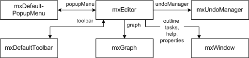

# Editor

:::warning

The content of this page is a **work in progress**.
The original `mxGraph` tutorial was used to create this page which still contains `mxGraph` class diagrams to migrate to the maxGraph API.

:::

:::note

This tutorial is licensed under [Creative Commons Attribution 4.0 International (CC BY 4.0)](https://creativecommons.org/licenses/by/4.0/). \
It is adapted from the original [mxGraph tutorial](https://github.com/jgraph/mxgraph/blob/v4.2.2/docs/tutorial.html).

> Copyright 2021-present The maxGraph project Contributors \
Copyright (c) JGraph Ltd 2006-2017

:::


Instantiate [Editor](https://maxgraph.github.io/maxGraph/api-docs/classes/Editor.html) in order to create an editor.
This is the central class in the editor package. Everything else in this package is auxiliary.

To create a new editor instance and configure it using a config file, you can pass the name of the config file to the
[Editor constructor](https://maxgraph.github.io/maxGraph/api-docs/classes/Editor.html).



To create a new editor instance and configure it, the following code is used:

```javascript
const config = mxUtils.load('editors/config/keyhandler-commons.xml').getDocumentElement();
const editor = new Editor(config);
```

The configuration file is an XML file that is passed to [Codec](https://maxgraph.github.io/maxGraph/api-docs/classes/Codec.html),
which in turn uses [EditorCodec](https://maxgraph.github.io/maxGraph/api-docs/classes/EditorCodec.html) and others to read the XML into the editor object hierarchy.

This is normally done at startup time to configure the editor, graph, model, toolbar, popupmenus, etc. using the [I/O subsystem](./editor-input-output.md).


<a id="CSS"></a>
## CSS

<p>
  The CSS stylesheet contains the style definitions for various
  elements of the user interface, such as the rubberband selection,
  the in-place editor or the popup menu. It also contains the directives
  required to enable VML support in Internet Explorer, so it is substantial
  that the stylesheet is included in the page.
</p>
<p>
  Additional stylesheets may either be added programmatically using
  <code>mxClient.link('stylesheet', filename)</code> or
  via a stylesheet tag of the UI section in the editor configuration, eg.:
</p>


```xml
&lt;Editor&gt;
  &lt;ui&gt;
    &lt;stylesheet name="examples/editors/css/process.css"/&gt;
    ...
```


<h2><a id="Templates"></a>Templates</h2>
<p>
  To add new cell types, create a template in the templates array section of
  the model in the config file (mxEditor/mxGraph/mxGraphModel/Array[as=templates])
  as follows:
</p>
<pre>
&lt;add as="symbol"&gt;
  &lt;Symbol label="Symbol" customAttribute="whatever"&gt;
    &lt;mxCell vertex="1" connectable="1" style="symbol;image=images/event.png"&gt;
      &lt;mxGeometry as="geometry" width="32" height="32"/&gt;
    &lt;/mxCell&gt;
    &lt;CustomChild customAttribute="whatever"/&gt;
  &lt;/Symbol&gt;
&lt;/add&gt;
</pre>
<p>
  The <code>as</code>-attribute of the <code>add</code>-element contains the
  name under which the template will be accessible for later use. The
  <code>Symbol</code>-child element is a custom (ie workflow) element, and
  can have any name and any number of child elements and custom attributes.
  The label attribute is a special one that is used for the textual
  representation of the cell in the graph. The <code>mxCell</code> element
  is another special child node which contains the graphical information for
  the cell, namely, the cell-type, -style, -size and -position.
</p>
<p>
  See mxGraph.convertValueToString if you would like to use another
  attribute or a combination of attributes for the textual representation,
  and <code>mxCell.valueChanged</code> to handle in-place editing by storing
  the new text value in the respective attribute(s).
</p>


<h2><a id="Toolbar"></a>Toolbar</h2>
<p>
  To use the template in the graph, a toolbar item must be added which refers
  to the template in the mxDefaultToolbar section of the config file
  (mxEditor/mxDefaultToolbar[as=toolbar]) as follows:
</p>
<pre>
&lt;add as="symbolTool" template="symbol"
  style="symbol;image=wf/images/bpmn/special_event.png"
  icon="wf/images/bpmn/small_event.gif"/&gt;
</pre>
<p>
  The <code>as</code> attribute specifies the tooltip to be displayed for the
  icon in the toolbar, the <code>template</code>-attribute refers to the name
  under which the template was previously added. The <code>style</code>-
  attribute is optional, and may be used to override the style defined in the
  template definition. Finally, the icon specifies the icon to be used for the
  toolbar item.
</p>
<p>
  Note that the <code>as</code> attribute is assumed to be the key for a language
  resource, in this case <code>symbolTool</code>. If the resource is not defined
  in <a href="js-api/files/util/mxResources-js.html">mxResources</a>, then the
  attribute value is used as the label.
</p>
