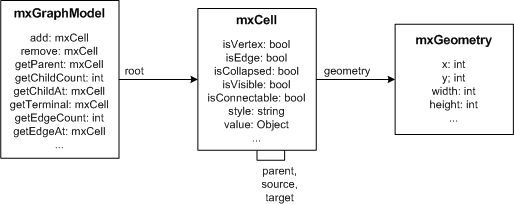

[//]: # (TODO add mxGraph copyright)

# Graphs

<p>
  Instantiate <a href="js-api/files/view/mxGraph-js.html">mxGraph</a>
  in order to create a graph. This is the central class in the API.
  Everything else is auxiliary.
</p>


<p>
  To create a new graph instance, a DOM node (typically a DIV) is
  required:
</p>
<pre>
let node = document.getElementById('id-of-graph-container');
let graph = new mxGraph(node);
</pre>
<h2><a id="Model"></a>Model</h2>
<p>
  <a href="js-api/files/model/mxCell-js.html">mxCell</a> defines the
  elements of the graph model, which is implemented by
  <a href="js-api/files/model/mxGraphModel-js.html">mxGraphModel</a>.
</p>




<p>
  The graph model has the following properties:
</p>
<ul>
  <li>
    The root element of the graph contains the layers.
    The parent of each layer is the root element.
  </li>
  <li>
    A layer may contain elements of the graph model,
    namely vertices, edges and groups.
  </li>
  <li>
    Groups may contain elements of the graph model,
    recursively.
  </li>
</ul>
<p>
  The graph and structural information is stored in the cells, as well as the
  <i>user objects</i>, which are used to store the <i>value</i> associated with
  the cells (aka business objects).
</p>
<p>
  To create a new graph model with a root cell and a default layer (first child):
</p>

```javascript
const root = new Cell();
root.insert(new Cell());
const model = new GraphDataModel(root);
```


<h2><a id="Stylesheet"></a>Stylesheet</h2>
<p>
  The appearance of the cells in a graph is defined by the
  stylesheet, which is an instance of
  <a href="js-api/files/view/mxStylesheet-js.html">
  mxStylesheet</a>.
  The stylesheet maps from stylenames to styles.
  A style is an array of key, value pairs to be
  used with the cells. The keys are defined in
  <a href="js-api/files/util/mxConstants-js.html">
  mxConstants</a> and the values may be
  strings and numbers or JavaScript objects or functions.
</p>
<p>
  To modify the default styles for vertices and edges in an existing graph:
</p>
<pre>
let vertexStyle = graph.getStylesheet().getDefaultVertexStyle();
vertexStyle[mxConstants.STYLE_ROUNDED] = true;

let edgeStyle = graph.getStylesheet().getDefaultEdgeStyle();
edgeStyle[mxConstants.STYLE_EDGE] = mxEdgeStyle.TopToBottom;
</pre>
<h2><a id="Styles"></a>Styles</h2>
<p>
  The style information for a cell is stored in <code>cell.style</code>.
  The style is part of the cell's state and is normally changed via
  <code>mxGraphModel.setStyle</code>, which will update all views.
  The cell style is a string of the form
</p>
<pre>
[stylename;|key=value;]
</pre>
<p>
  which tells the graph to use the given named styles and override the
  specified key, value pairs in the given order. For example, to use the
  <a href="js-api/files/view/mxStylesheet-js.html#mxStylesheet.putCellStyle">rounded</a>
  style and override the stroke- and fillColor, the style would be defined as:
</p>
<pre>
rounded;strokeColor=red;fillColor=green
</pre>
<p>
  To use the above in Hello, World!, the stylename would be passed to the
  insertVertex method as follows:
</p>
<pre>
var v1 = graph.insertVertex(parent, null, 'Hello',
  20, 20, 80, 30, 'rounded;strokeColor=red;fillColor=green');
</pre>
<h2><a id="Appearance"></a>Appearance</h2>
<p>
  In certain cases you may want to override specific attributes based on
  dynamic properties of a cell (ie. it's value, aka. userobject), such as
  the image, indicator shape, -image, -color or -gradient color), in
  which case you can override <code>getImage</code>,
  <code>getIndicatorShape</code>, <code>getIndicatorImage</code>,
  <code>getIndicatorColor</code> and <code>getIndicatorGradientColor</code>
  respectively. Note that these methods take a cell state as an argument,
  which points to a "resolved" (that is, an array) version of the
  cell's style. Hence, the default implementation for <code>getImage</code>
  looks as follows:
</p>
<pre>
mxGraph.prototype.getImage = function(state)
{
  if (state != null &amp;&amp; state.style != null)
  {
    return state.style[mxConstants.STYLE_IMAGE];
  }
  return null;
}
</pre>
<p>
  This method may be overridden to return any image for the given state.
  Typically, the image is defined by either <code>state.cell</code>,
  which points to the graph cell associated with the state, or by
  <code>state.cell.value</code>, which refers to the cell's user object.
</p>
<p>
  Due to the nature of the display, where all cells are created once and
  updated only if the model fires a notification for a change, you must
  invoke <code>view.invalidate(cell)</code> for each cell whose image
  has changed, and call <code>view.validate</code> to update the display.
</p>
<h1><a id="Editors"></a>Editors</h1>
<p>
  Instantiate <a href="js-api/files/editor/mxEditor-js.html">mxEditor</a> in
  order to create an editor. This is the central class in the editor
  package. Everything else in this package is auxiliary.
  To create a new editor instance and configure it using a config
  file, you can pass the name of the config file to the
  <a href="js-api/files/editor/mxEditor-js.html#mxEditor.mxEditor">mxEditor constructor</a>.
</p>


<p>
  To create a new editor instance and configure it, the following code is used:
</p>
<pre>
let config = mxUtils.load('editors/config/keyhandler-commons.xml').getDocumentElement();
let editor = new mxEditor(config);
</pre>
<p>
  <b>TODO add link to the codecs page</b>
  The configuration file is an XML file that is passed to
  <a href="js-api/files/io/mxCodec-js.html">mxCodec</a>, which in
  turn uses <a href="js-api/files/io/mxEditorCodec-js.html">mxEditorCodec</a>
  and others to read the XML into the editor object hierarchy. This is normally
  done at startup time to configure the editor, graph, model, toolbar, popupmenus
  etc using the <a href="#InputOutput">I/O subsystem</a>.
</p>


<h2><a id="CSS"></a>CSS</h2>
<p>
  The CSS stylesheet contains the style definitions for various
  elements of the user interface, such as the rubberband selection,
  the in-place editor or the popup menu. It also contains the directives
  required to enable VML support in Internet Explorer, so it is substantial
  that the stylesheet is included in the page.
</p>
<p>
  Additional stylesheets may either be added programmatically using
  <code>mxClient.link('stylesheet', filename)</code> or
  via a stylesheet tag of the UI section in the editor configuration, eg.:
</p>


<pre>
&lt;mxEditor&gt;
  &lt;ui&gt;
    &lt;stylesheet name="examples/editors/css/process.css"/&gt;
    ...
</pre>


<h2><a id="Templates"></a>Templates</h2>
<p>
  To add new cell types, create a template in the templates array section of
  the model in the config file (mxEditor/mxGraph/mxGraphModel/Array[as=templates])
  as follows:
</p>
<pre>
&lt;add as="symbol"&gt;
  &lt;Symbol label="Symbol" customAttribute="whatever"&gt;
    &lt;mxCell vertex="1" connectable="1" style="symbol;image=images/event.png"&gt;
      &lt;mxGeometry as="geometry" width="32" height="32"/&gt;
    &lt;/mxCell&gt;
    &lt;CustomChild customAttribute="whatever"/&gt;
  &lt;/Symbol&gt;
&lt;/add&gt;
</pre>
<p>
  The <code>as</code>-attribute of the <code>add</code>-element contains the
  name under which the template will be accessible for later use. The
  <code>Symbol</code>-child element is a custom (ie workflow) element, and
  can have any name and any number of child elements and custom attributes.
  The label attribute is a special one that is used for the textual
  representation of the cell in the graph. The <code>mxCell</code> element
  is another special child node which contains the graphical information for
  the cell, namely, the cell-type, -style, -size and -position.
</p>
<p>
  See mxGraph.convertValueToString if you would like to use another
  attribute or a combination of attributes for the textual representation,
  and <code>mxCell.valueChanged</code> to handle in-place editing by storing
  the new text value in the respective attribute(s).
</p>


<h2><a id="Toolbar"></a>Toolbar</h2>
<p>
  To use the template in the graph, a toolbar item must be added which refers
  to the template in the mxDefaultToolbar section of the config file
  (mxEditor/mxDefaultToolbar[as=toolbar]) as follows:
</p>
<pre>
&lt;add as="symbolTool" template="symbol"
  style="symbol;image=wf/images/bpmn/special_event.png"
  icon="wf/images/bpmn/small_event.gif"/&gt;
</pre>
<p>
  The <code>as</code> attribute specifies the tooltip to be displayed for the
  icon in the toolbar, the <code>template</code>-attribute refers to the name
  under which the template was previously added. The <code>style</code>-
  attribute is optional, and may be used to override the style defined in the
  template definition. Finally, the icon specifies the icon to be used for the
  toolbar item.
</p>
<p>
  Note that the <code>as</code> attribute is assumed to be the key for a language
  resource, in this case <code>symbolTool</code>. If the resource is not defined
  in <a href="js-api/files/util/mxResources-js.html">mxResources</a>, then the
  attribute value is used as the label.
</p>
