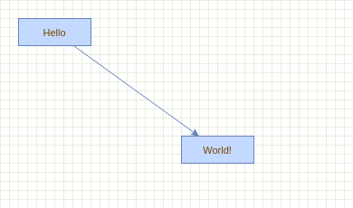

# The Hello World Example

:::note

This tutorial is licensed under [Creative Commons Attribution 4.0 International (CC BY 4.0)](https://creativecommons.org/licenses/by/4.0/). \
It is adapted from the original [mxGraph tutorial](https://github.com/jgraph/mxgraph/blob/v4.2.2/docs/tutorial.html).

> Copyright 2021-present The maxGraph project Contributors \
Copyright (c) JGraph Ltd 2006-2017

:::

<a id="HelloWorld"></a>
## Hello, World!

The _Hello, World!_ example of `maxGraph` ships in a Storybook story called `HelloWorld` which is available in the `HelloWorld` page of the [maxGraph demo](https://maxgraph.github.io/maxGraph/demo/?path=/story/basic-helloworld--default).

The source of the example is available in [HelloWorld.stories.js](https://github.com/maxGraph/maxGraph/blob/main/packages/html/stories/HelloWorld.stories.js).




## Container

For the JavaScript to actually render the graph, the page contains an DOM node which will display the graph.
This DOM node is either dynamically created or it is obtained via an ID using `document.getElementById` as in the _Hello, World!_ example.
The DOM node is passed to the main function and is used to construct the graph instance as shown below.

If you want the container to have scrollbars, use the `overflow:auto` CSS directive instead of overflow:hidden in the style of the container.


<a id="Graph"></a>
## Graph

The code constructs an empty graph model and passes the container and the empty model to the graph constructor.
For this example, all default event handling is disabled in the last line.

```javascript
const model = new GraphDataModel();
const graph = new Graph(container, model);
```

If you want the graph to be read-only you can use <code>graph.setEnabled(false)</code>.


<h2><a id="VerticesAndEdges"></a>Vertices and Edges</h2>
<p>
  To insert vertices and edges, <code>beginUpdate</code> and <code>endUpdate</code>
  are used to create a transaction. The <code>endUpdate</code> should always go
  into a finally-block to make sure it is always executed if the <code>beginUpdate</code>
  was executed. However, the <code>beginUpdate</code> should not be part of the
  try-block to make sure <code>endUpdate</code> is never executed if <code>beginUpdate</code>
  fails. This is required for the model to remain in a consistent state, that is, for
  each call to <code>beginUpdate</code> there should always be exactly one call to
  <code>endUpdate</code>.
</p>
<p>
  The part within the try-block creates the vertices and edges for the graph.
  The default parent is obtained from the graph and is typically the first
  child of the root cell in the model, which is created automatically when
  using the graph model constructor with no arguments.
</p>

```javascript
// Gets the default parent for inserting new cells. This
// is normally the first child of the root (ie. layer 0).
let parent = graph.getDefaultParent();

// Adds cells to the model in a single step
model.beginUpdate();
try  {
    const v1 = graph.insertVertex(parent, null, 'Hello,', 20, 20, 80, 30);
    const v2 = graph.insertVertex(parent, null, 'World!', 200, 150, 80, 30);
    graph.insertEdge(parent, null, '', v1, v2);
}
finally {
    // Updates the display
    model.endUpdate();
}
```

<p>
  The use of <code>beginUpdate</code> and <code>endUpdate</code> does not
  only improve the display performance, but it is also used to mark the
  boundaries for undoable changes when undo/redo is used.
</p>
