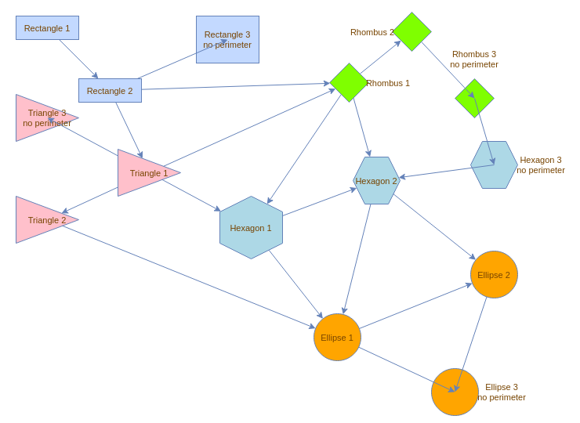
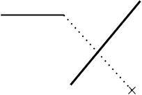
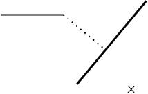

# Perimeters

:::info
The examples in this page use `TypeScript`; adapt them if you write `JavaScript`.
:::

## What is a Perimeter?

A `Perimeter` is a function that determines the start or end point of an edge, ensuring it is placed correctly on the source or target vertex.

A `Perimeter` is configured within the style properties of the Cell that relates to the Vertex.

When setting it up, ensure it aligns with the shape of the vertex. Otherwise, the terminal point of the edge may not appear on the visual perimeter of the vertex.  

By default, a vertex perimeter is a _rectangle_.

:::note
All perimeters provided by `maxGraph` are automatically registered in the `StyleRegistry` when a `Graph` instance is created. For more details, see the [Global Configuration](global-configuration.md#styles) documentation.  
To check the list of registered perimeters, refer to the `registerDefaultStyleElements` function.
:::

### Disabling the Perimeter

It is possible to configure a vertex to ignore the perimeter. To do so, set `style.perimeter` to `null` or `undefined`.  
In this case, the edge connects directly to the center of the vertex.  
This center is calculated based on the vertex’s bounding box (i.e., the rectangle defined by its width and height).

### Example

The following image shows various perimeters in action and illustrates the difference between a vertex with a perimeter and a vertex without a perimeter.
It is taken from the Storybook demo.



:::note
The image above has been produced using the Storybook demo:
- live demo: [PerimeterVariousImplementations](https://maxgraph.github.io/maxGraph/?path=/story/perimeters--perimeter-various-implementations)
- source code: [PerimeterVariousImplementations.stories.ts](https://github.com/maxGraph/maxGraph/blob/main/packages/html/stories/PerimeterVariousImplementations.stories.ts)
  :::


## Terminal Edge Points Computation with a Perimeter

When rendering an edge, `maxGraph` retrieves the perimeter of its source vertex.  
Using the edge’s points and this function, it computes the terminal point on the perimeter.  
The same process is applied to the target vertex.

If an edge has no source and/or no target, the concept of a perimeter does not apply. In such cases, no terminal point is computed for the edge.  
These edges, known as _dangling edges_ (edges without a source and/or target), simply extend from their assigned points.

To compute the "perimeter point" of an edge, `maxGraph` follows these steps:
1. Use the last point of the edge.
2. Create a segment between the center of the shape and this point.
3. Compute the intersection of this segment with the perimeter.  
   The resulting point is then used as the terminal point of the edge.

| Context                                                                                        | Computation based on the center            |
|------------------------------------------------------------------------------------------------|--------------------------------------------|
|  |  |


### Orthogonal Projection on the Perimeter

An alternative method is available, using an orthogonal projection onto the perimeter.  
Instead of computing the intersection of the final segment with the perimeter, `maxGraph` calculates the orthogonal projection of the point onto the perimeter.

To enable this behavior, set `style.orthogonal` to `true` in the edge style.

By default, this is also applied when `style.orthogonal` is not explicitly set, but the edge style belongs to one of the "orthogonal" `EdgeStyle` connectors.


| Context                                                                                        | Computation with orthogonal projection                                                                                              |
|------------------------------------------------------------------------------------------------|-------------------------------------------------------------------------------------------------------------------------------------|
|  |  |


The list of `EdgeStyle` configurations considered orthogonal is defined in `Graph.isOrthogonal`.  
This includes, for example, `SegmentConnector` and `EntityRelation`.

:::note  
An example of orthogonal projection is available in the Storybook demo:
- **Live demo**: [Orthogonal](https://maxgraph.github.io/maxGraph/demo/?path=/story/connections-orthogonal--default)
- **Source code**: [Orthogonal.stories.js](https://github.com/maxGraph/maxGraph/blob/main/packages/html/stories/Orthogonal.stories.js)  
:::


## How to Use a Specific Perimeter

:::info
For more details about the usage of perimeters, see the documentation of `CellStateStyle.perimeter`
:::

`maxGraph` provides various perimeter functions under the `Perimeter` namespace to be used in the `style` property of a Vertex as the value of `CellStateStyle.perimeter`.

```javascript
style.perimeter = Perimeter.EllipsePerimeter;
```

It is also possible to set the perimeter using a string under which the perimeter has been registered in `StyleRegistry`.
By default, `maxGraph` registers all perimeters functions under the `Perimeter` namespace in the `StyleRegistry`:

```javascript
style.perimeter = 'rhombusPerimeter';
```

:::tip

The `CellStateStyle.perimeter` type guides you on how to set the perimeter value when configuring the value with a string.

:::

It is possible to configure the default perimeter for all vertices in the `Graph` as follows:

```javascript
const style = graph.getStylesheet().getDefaultVertexStyle();
style.perimeter = Perimeter.HexagonPerimeter;
```

## Custom Perimeter

### Creating a Custom Perimeter

A perimeter is a function matching the `PerimeterFunction` type:

```typescript
const CustomPerimeter: PerimeterFunction = (
    bounds: Rectangle,
    vertex: CellState,
    next: Point,
    orthogonal = false
    ): Point => {
  const x = 0; // Calculate x-coordinate
  const y = 0; // Calculate y-coordinate

  return new Point(x, y);
}
```

The new perimeter can then be registered in the `StyleRegistry` as follows if you are intended to use it as a string in `CellStateStyle.perimeter`:
```javascript
StyleRegistry.putValue('customPerimeter', CustomPerimeter);
```

### Using a Custom Perimeter

The custom perimeter above can now be used in a specific vertex as follows:

```javascript
model.setStyle(vertex, {...vertex.style, perimeter: 'customPerimeter'});
```

Or it can be used for all vertices in the `Graph` as follows:

```javascript
const style = graph.getStylesheet().getDefaultVertexStyle();
style.perimeter = 'customPerimeter';
```

## Example of custom behavior

It is possible to create a perimeter that places the edge on the bounds of the label of a vertex. See the Storybook demo:
- live demo: [PerimeterOnLabelBounds](https://maxgraph.github.io/maxGraph/demo/?path=/story/labels-perimeteronlabelbounds--default)
- source code: [PerimeterOnLabelBounds.stories.ts](https://github.com/maxGraph/maxGraph/blob/main/packages/html/stories/PerimeterOnLabelBounds.stories.ts)
